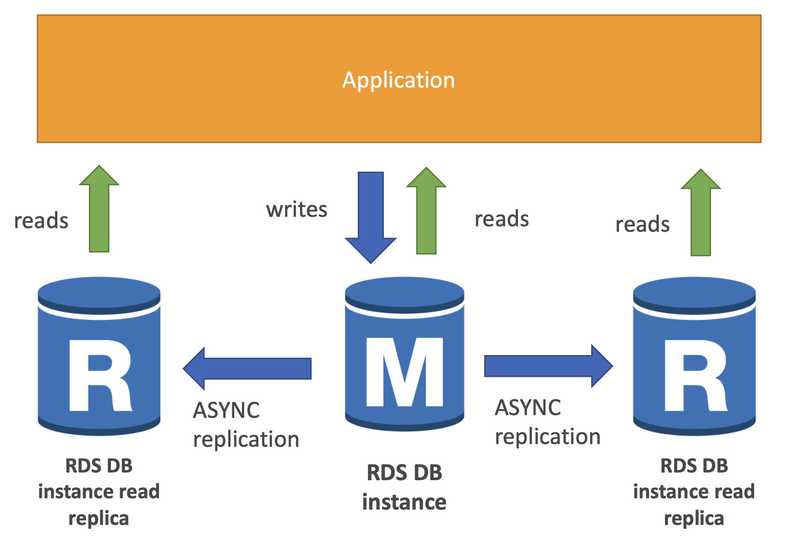
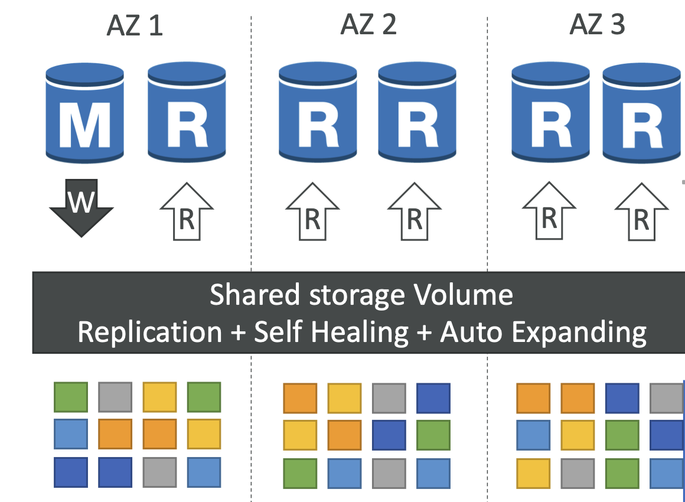
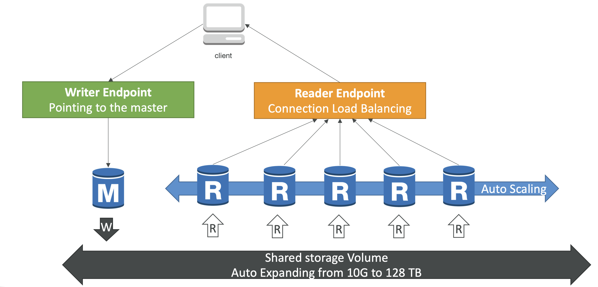
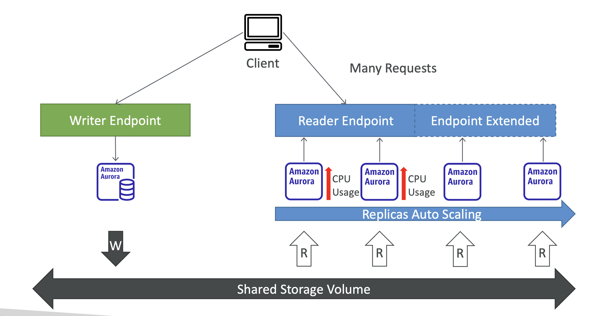
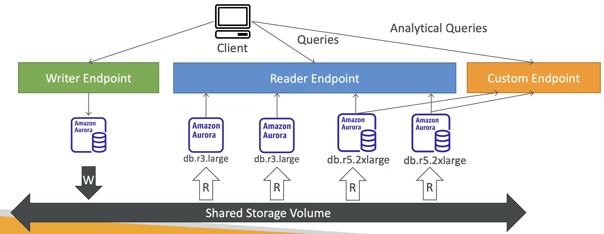
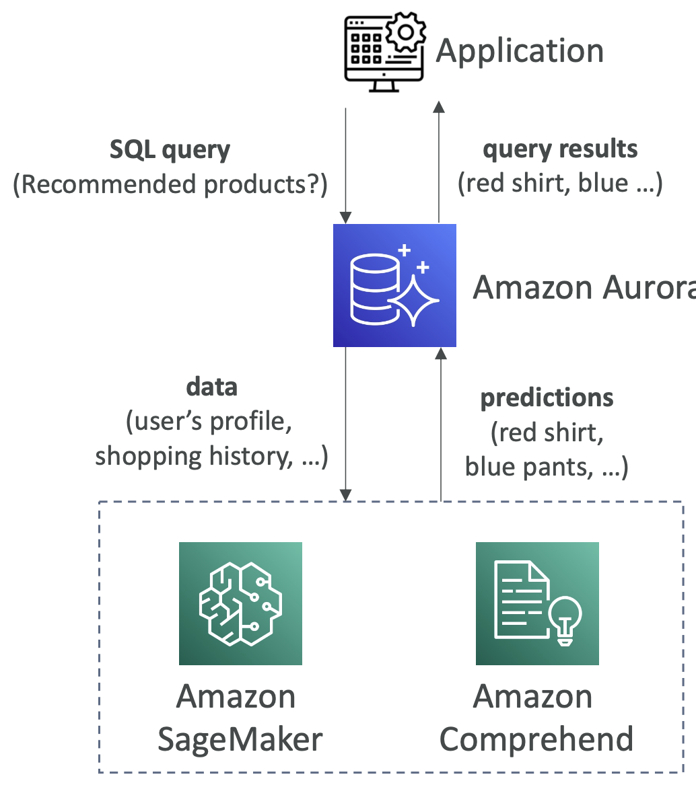

# Relational Database Services (RDS)

- RDS is a managed database service from AWS
- It uses SQL and supports the following databases:

1. Postgres
2. MySQL
3. MariaDB
4. Oracle
5. Microsoft SQL server
6. IBM DB2
7. Aurora (AWS proprietary service)

## Why use a managed service?

AWS manages the whole service for you, including deployment of databases onto infrastructure. Because it's managed, you don't have access to the underlying infra, so you can't SSH into the DB servers. 

Advantages of this:

- Automated provisioning, OS patches
- Backups 
- Monitoring dashboards
- Scaling (horizontal and vertical)
- Multi AZ (recovery)
- Read replicas (performance)

## Storage Auto Scaling

AWS can scale DB stores automatically depending on usage. For e.g when you are running out of DB space.

You have to set a **Maximum Storage Threshold**. 

> Auto scaling is good for apps with unpredictable DB operations## Storage Auto Scaling

## Read Replicas VS Multi AZ

### Read Replicas

Read replicas are DB replicas of the main DB that allow for more read operations (scalability). 

They work by replicating the main DB and then allowing read operations to those replicas. 

The data between the main DB and replica DBs is *eventually consistent*, meaning that they will eventually have identical data, but there is a chance a read operation to a replica will receive back outdated data. 

Replicas can also be promoted to their own DB.

#### Network Costs for replicas

There are network costs associated with replicas. If you replicate across a different AZ, a fee is incurred, else it's free. 

### Multi AZ

Multi AZ RDS are DB instances that are on standby should something go wrong with the master DB. 

This helps increase availability

> Multi AZ RDS is good for database availability

There is just one DNS name needed and if there is network loss, instance of storage failure, read and write operations will be passed to the instance on standby:

**There is no downtime associated when creating Multi AZ - you just modify the DB**

> Important to know that you can also use read replicas for Disaster Recovery (DS)

## RDS Custom

While it's been mentioned that RDS is a fully managed service, with two databases you do get OS access and can SSH into the instances:

- Orcale 
- Microsoft SQL server

For these two DBs you can:

- Configure settings
- Install patchesEnable features
- Access EC2 instance using SSH

> RDS is a managed services, except for Oracle and MS SQL, which allow customisation and EC2 access

## Amazon Aurora

This is Amazon's proprietary database offering, it's not open source. It:

- Aurora works with bothPostgres and MySql.
- Has 5x better perf than MySQL and 3x the perf of Postgres
- Storage automatically grows in 10GB increments, up to 128TB
- Can have 15 read replicas
- Failover is instantaneous

### Aurora availability and read scaling

Aurora created 6 copies of data across 3 AZs (diagram).

The storage is self healing and auto expanding. 

One instance takes writes (the master) and the data is replicated across the instances, which can be used for read operations. 

## Aurora Cluster

Aurora has a:

1. Shared volume
2. 1 master writer - one endpoint
3. 5 readers - one endpoint that scale automatically

## Advanced - Aurora replicas and auto scaling

If read endpoints receive much more traffic then the read replicas will autoscale:

## Avanced - replicas and custom endpoints

By default, replicas share the same endpoint, but you can specify a custom endpoint should some of your replicas be unique, for example the DBs are larger or more powerful:

## Advanced - Aurora serverless

Serverless option from AWS that:

- automatically scales depending on usage
- no storage planning needed
- pay per second pricing model

## Advanced - global availability

For global availability you can:

1. Create Aurora cross region availability using read replicas
2. Use an Aurora global database (recommended):

The global database has:

- 1 primary region
- up to 5 additional read only regions 
- 16 read replicas in the regions
- helps decrease latency globally
- replication takes less than 1s

> In the exam when "cross region replication < 1s" is mentioned, it's referring to Aurora Global

## Advanced - Aurora Machine Learning

SQL integration with other AWS ML tools: SageMaker and Comprehend. It basically takes data from your Aurora tables and uses them to power ML tools. The data will be routed through Aurora:

## RDS Backups

There are two ways to backup:

1. Automated Backups: daily full backups, can restore from any point up to 5 min before backup (so any time in the past up until 5min ago). 1-35 days retention
2. Manual DB Snapshots: manually triggered and retention as long as you want

> To save money, instead of stopping a DB (you will still pay) you can create a snapshot and restore from there in the future

## Aurora backups

It's similar, with automated backups and manual DB snapshots. Automated backups cannot be turned off!

## Restoring operations

Two options:

1. Restoring automatically from backup/snapshot. This will create a new DB.
2. Restore MYSQL / Aurora from S3. Involves creating a backup on S3 and then restoring from there. For Aurora you have to use Percona XtraBackup for this.

## Aurora DB cloning

Creates new Aurora cluster from an existing one. You can do this to run DB testing, for example. 

When the new cluster is created and new write operations are made to it, new storage is allocated only to the new DB cluster.

## RDS Proxy

There is a fully managed proxy service with RDS. A proxy is a middle man between client applications and (in this case) a DB server.

Proxies help reduce load on DB servers by improving the performance, scalability and security of DB communication. They do this by: load balancing, pooling connections, caching, query optimisation etc.

The RDS proxy service:

- Allows apps to pool and share DB connections
- Improves DB efficiency by reducing stress on DB resources
- Autoscales, multi AZ
- Supports SQL (Postgres, mySQL, MariaDB etc)
- Enforce IAM auth and store creds in AWS secrets manager
- Proxy is never publicly acessible

