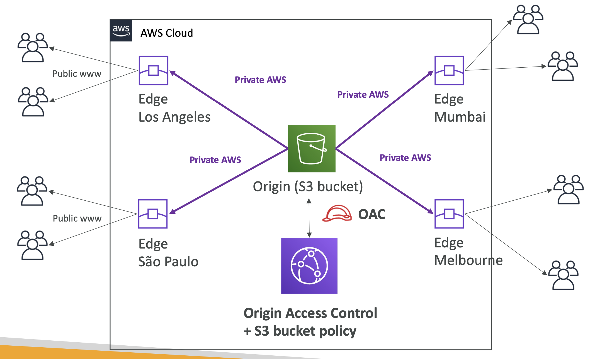
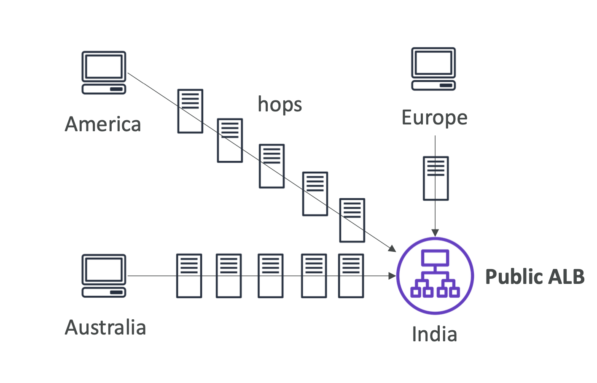
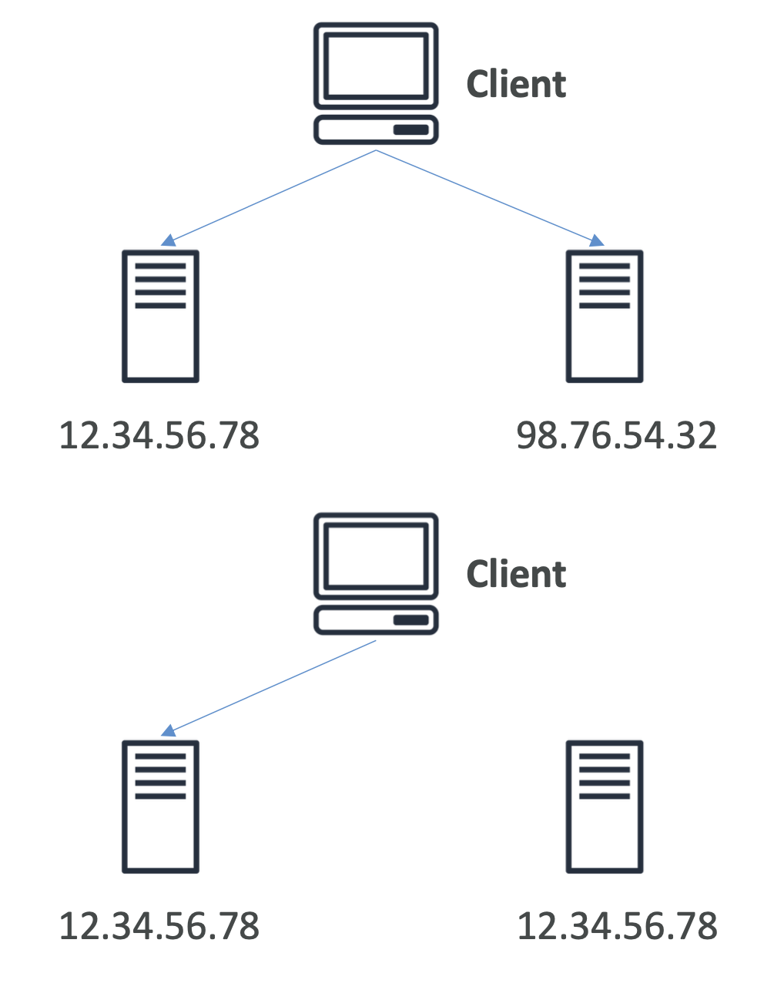

# Cloudfront

Cloudfront is AWS' CDN.

It caches content at 216 edge locations around the world.

The **benefits** are:

1. Improved performance (latency)
2. Improves UX
3. DDoS protection by distributing server load

A list of the locations is [here](https://aws.amazon.com/cloudfront/features/#Global_Edge_Network)

## Origins

These are the information sources that can be used with Cloudfront.

1. S3
2. VPC (app hosted in private network)
3. Any custom origin (HTTP) e.g any public HTTP backend
4. ALB
5. EC2 instances

## How does it work?

Using S3 as an example:

## Cloudfront VS region replication

This is a common question. If Cloudfront manages global access, how do other AWS features that do similar things differ.

**Cloudfront**:

- Uses the edge network
- Caches files 
- Good for static content not changing often

**S3 Cross region replication**:

- Setup for each region
- Does not cache, files updated in realtime
- Read only
- Good for dynamic content, often changing that needs to be available in a *few* regions. Not for content that needs to be globally available.

> If Cloudfront does not have cached content in the edge location, it will reach out to the origin

## ALB or EC2 as origins using VPCs

Using VPC origins allow you to deliver content from apps hosted in private subnets.

Traffic can be delivered to private ALBs, NLBs and EC2 instances

> You can choose what to expose through Cloudfront, which is highly secure

## Georestriction

Can setup an allow list for a list of approved/banned countries. 

IPs are mapped to Geolocations internally by AWS.

## Pricing

Cost per location varies. E.g Mexico and US are much cheaper than India (surprisingly).

### Price classes

You can reduce cost by reducing the number of edge locations:

1. **All**: all regions, best performance
2. **200**: most regions, less expensivr
3. **100**: least expensive regions

## Cache invalidation

If you change origin, Cloudfront won't update content until TTL expires.

You can force the change using *Cloudfront invalidation*, which will remove files from the cache.

## Global accelerator

To further reduce latency, global accelerator accelerates a user through the network. This prevents many hops:

It does this by utilising **Anycast IP**, which gives multiple servers the same IP, but routes the user to the nearest one:

Global accelerator uses the Anycast IP to achieve acceleration.

Benefits:

1. Lowest latency and regionla failovers
2. No issue with client cache
3. Works on internal AWS network
4. Health check compatible
5. Secure because only 2 external IPs exposed
6. DDoS protection

