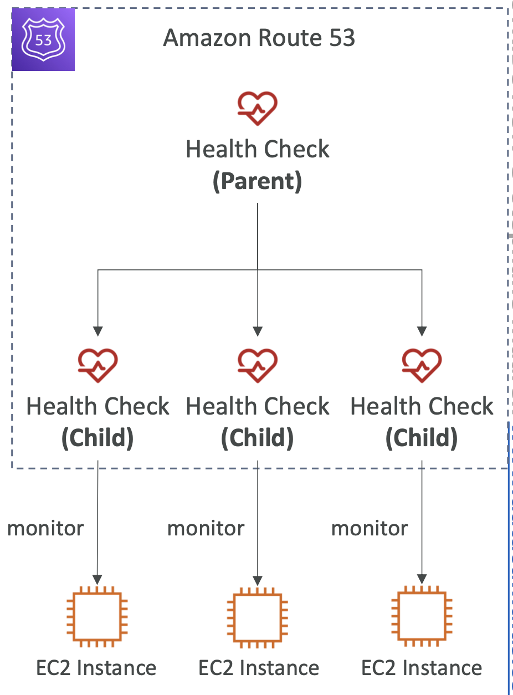

# Route 53 

## What is DNS?

Domain Name Servers (DNS) are a way to resolve website URLs to IP addresses. 

For example translating www.google.com to it's IP address of 172.217.18.36.

## URL breakdown

This is the breakdown of a URL: 

## How DNS works

The process of resolving an IP address takes many steps, including reaching out to many servers:

## Amazon Route 53

This is Amazon's DNS service and domain registrar.

Requests to websites registered with Route 53 will go to Amazon's Route 53 DNS.

## Route 53 DNS records

DNS records are instructions stored on DNS records that allow us to connect domain names to IP addresses. Route 53 is *authoritative*, meaning you have control over your DNS records.

Route 53 supports the following records:

- **Must know**: A / AAAA / CNAME / NS
- **Advanced**: CAA / DS / MX / NAPTR / PTR / SOA / TXT / SPF / SRV

### Record types

- **A**: maps a domain name to an IPv4 address
- **AAAA**: maps a domain name to an IPv6 address
- **CNAME**: maps a hostname to another hostname. C stands for "canonical" and CNAMEs allow you to create aliases for your domain names. For example, you could point example.domain.com to domain.com to resolve the IP address, instead of to the IP address itself. The IP resolution will happen at domain.com
- **NS**: Name Servers for the hosted zone. This controls how traffic is routed for the domain.

## Route 53 - Hosted Zones

Hosted Zones are containers that define how to route traffic to a domain and subdomains. For example you can have:

- **Public Hosted Zones**: records that define how to route public domain names
- **Private Hosted Zones**: records that define how to route private domain names

## TTL (Time to live)

TTL is basically how long the client should cache DNS records. You can set TTL for each DNS record, which tells the browser to not make another DNS request once it has the record for that duration.

## CNAME Vs Alias

### CNAME

CNAME is a way to point one domain to another domain `app.mydomain.com => blabla.amazon.aws.com`, for example.

However, this only work for non root domains. `mydomain.com` wouldn't work, for example. 

### Alias

This points a hostname to an AWS resource `mydomain.com` to `myalb.amazonaws.com`.

Here we are pointing a root domain to an AWS resource. 

This works for both root and non root domains.

## Routing policy

The routing policy is the policy that defines how DNS responds to queries, so how the IP name is resolved for a domain name.

### Simple routing

This just routed traffic to a single resouce. For example `foo.example.com` is routed to `11.22.33.44`.

If there are multiple IP addresses for the same records, the client will randomly choose one. 

- If alias is enabled, you can only specify one resource
- No health checks possible

### Weighted routing

Weighted routing allows you to define a relative amount of traffic to be routed to a resource.

AWS will apply a percentage of traffic to that resource correlating to the weight set.

For example:

- weighted.example.com (some ip) -> 10 (some ip)
- weighted.example.com (some ip) -> 70 (some ip)
- weighted.example.com (some ip) -> 20 (some ip)

70% of traffic will be sent to the second resource.

A weight of 0 means don't sent traffic.

> Use cases can be load balancing, testing new apps on a % of traffic etc

### Latency-based

Routes requests from the user to the nearest resource

> This is useful when latency is a priority

### Failover routing

Failover routing is directly related to Health Checks (below).

If a resource is deemed unhealthy, then the failover routing will reroute the request to the healthy resource:

You define two records for the failover, if the primary records fails, it will failover to the second record.

### Geolocation routing

This will route users based on Geolocation. It can be by continent, country, or even US state.

Can be associated with health checks.

> Use cases: website localisation, load balancing

## Health checks

Health checks check the status of our instances and whether they are running or down.

They are for **public resources** only. The health checkers come from outside our instances, so our resources need to be public facing to be evaluated by the health checkers.

There are three types:

1. Health checks that monitor an endpoint (app, server etc)
2. Health checks that monitor other health checks (Calcualted Health Checks)
3. Health checks that monitor CloudWatch Alarms (e.g DynamoDB, alarms on RDS)

### Endpoint monitoring

- 15 global health checkers will monitor endpoint health.
- If endpoint responds with `2**` or `3**`, then it's considered **healthy**, otherwise it's **unhealthy**:

### Calculated Health Checks

- Combine multiple health checks into one
- Uses operators like **AND**, **OR**, **NOT**

### Private hosted zones

You can create a CloudWatch Metric and associated CloudWatch Alarm then create a Health Check that checks the alarm itself

## Routing policies - failover

Associated a route with an instance, which has an attached health check. 

If the health check fails then the request is routed to a second instance:

## Routing policies - geolocation

This allows you to define an IP per country:

- Different from latency based
- Based on user location
- Can specify by continent, country, us state etc

> Use cases can include: localisation, restrict content distribution, load balancing

## Routing policies - geoproximity

This will automatically route traffic based on user location. 

Locations can have a bias, which shifts more traffic to that resource and will gravitate user to that location:

