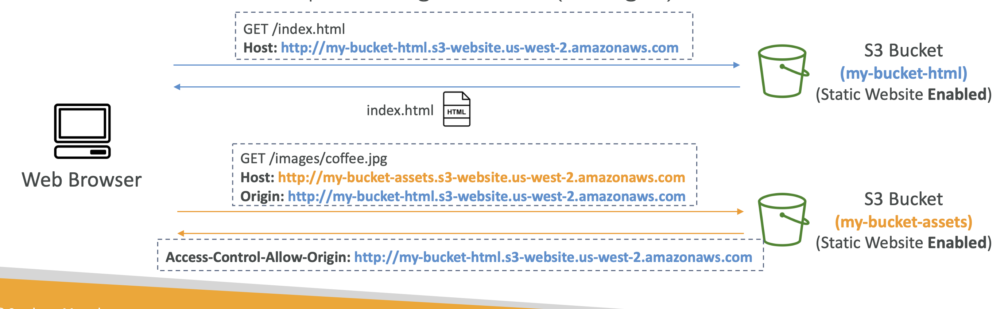
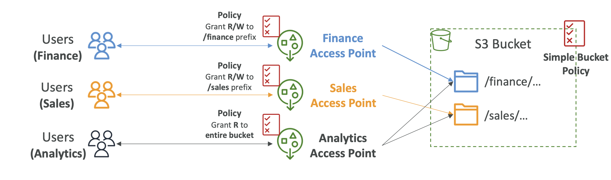
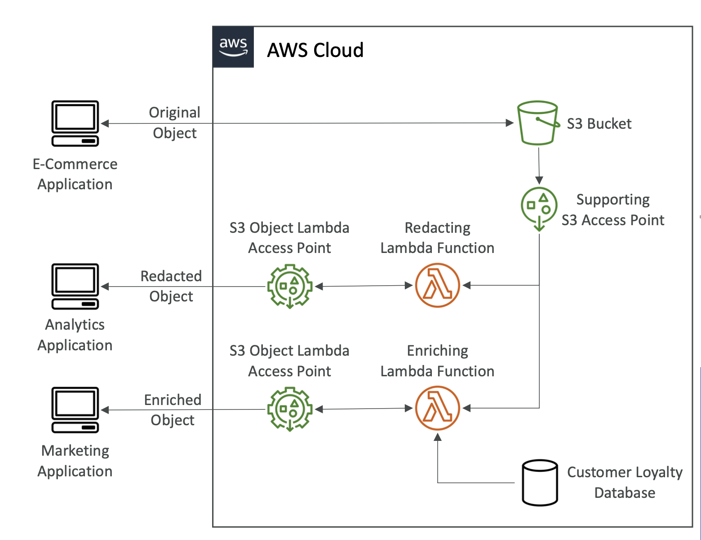

# S3 Security

## Object encryption

1. Serverside encryption (SSE-S3 [default], SSE-KMS, SSE-C)
2. Client side encryption

### SSE-S3

- AWS manages the encryption
- You never have key access
- "AES-256"
- Enabled by default
- Encryption header must be set when object sent

### SSE-KMS

- Allows you to manage your own keys using Key Management Service (KMS)
- Key usage logged in CloudTrail
- Encryption header must be set when object sent: **x-amz-server-side-encryption: "aws-kms"**

> This means you have to make API calls to KMS, which will use KMS quota. You could be throttled

### SSE-C

- Encryption keys are outside of AWS
- Keys are transmitted to AWS using HTTPS
- AWS does not store encryption keys

### Client side encryption

- AWS client side encryption library can be used to encrypt data on the client before being sent to AWS
- Client fully manages key and encryption cycle


### Inflight encryption (SSL/TLS)

- S3 has an HTTP and HTTPS endpoint
- Using HTTPS allows for inflight encryption 

> To enforce in-transit encryption can be managed by a bucket policy that reject non-HTTPS connections

## CORS (cross origin resource sharing)

CORS is a browser security to allow/deny requests to other origins while on the primary origin.

- **Same origin**: http://example.com/app1 <> http://example.com/app2. The same because they share the same protocol (http) host (example.com) and port.
- **Different origins**: http://example.com/ <> http://other.example.com/.

The latter example will fail unless to other origin has a **CORS Header**.

This applies to S3 because requests made to S3 bucket may be denied unless we set CORS header on our bucket. 



Within AWS you can control these headers to allow for cross origin requests using a JSON config. Example:

```js
[
    {
        "AllowedHeaders": [
            "Authorization"
        ],
        "AllowedMethods": [
            "GET"
        ],
        "AllowedOrigins": [
            "<url of first bucket with http://...without slash at the end>"
        ],
        "ExposeHeaders": [],
        "MaxAgeSeconds": 3000
    }
]
```

## MFA delete

You can force MFA as an additional security measure. Users will have to provide MFA code before:

1. Permanently deleting an object
2. Suspend bucket versioning

> Only root accounts can enable MFA and bucket versioning *must* be enabled

> Deleting with MFA can only be done from CLI, Rest API etc

## Access logs

You can log all requests made to your S3 account and analyse the requests, such as with Amazon Athena.

Target logging bucket must be in the same region as the logs bucket. 

You can just enable it from AWS and define a log bucket and AWS will handle the rest, including access policies.

> Log bucket and target bucket must be separate,otherwise you'll hit a logging loop

## Pre-signed URLs

Pre-signed URLs are AWS generated URLs that allow you to pass permissions with URLs.

A use case: You want to give someone else file access, but don't want to make your bucket public. You generate a pre-signed URL, which will contain the permissions of the URL author for PUT and GET requests. The users with the file will be able to access the file if the author permissions allow it.

You can also set a URL expiration. 

> Best for temporary access to files!

## Glacier Vault Lock

Glacier buckets are designed for long term archive storage of objects. 

Glacier Lock Vault allows you to store objects once and then not allow deletes, only allowing `GET` requests.

This is called a **WORM** model (Write Once Read Many).

The Vault Lock Policy means the object can never be deleted by anyone!

> It's important for legal and data retention

There are 2 modes:

1. **Compliance**: *no one* can delete/modify an object!
2. **Governance**: some users with admin *can* make changes, so it's less strict

A **retention period** is the time period for which the protection lasts.

A **legal hold** protects the object indefinitely, regardless of retention mode and period, however, the mode can be flexibly applied (added, removed etc.)

## S3 Access Points

Access points define read/write access to bucket/object prefixes. Instead of having complex access policies, you can instead use Access Points that restrict access depending on object prefix:



> Access points simplify S3 security management

> Each access point has its own DNS and access point policy

It can be set at the VPC level as well, so the access point can only be accessible from the VPC

## S3 Object Lambda

We can use Lambda functions to edit/update objects on the fly.

We can create an access point that's connected to a Lambda function that edits the object on the fly:



Some use cases:

1. Redacting PIM before storage in analytics
2. Converting data, e.g XML to JSON
3. Resizing and watermarking images


