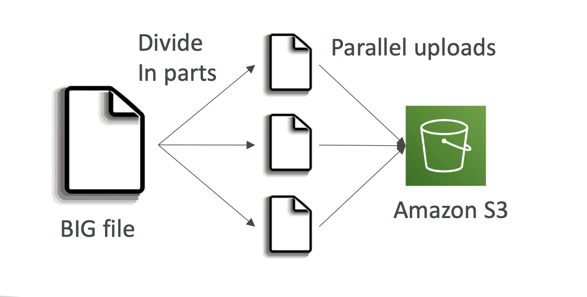
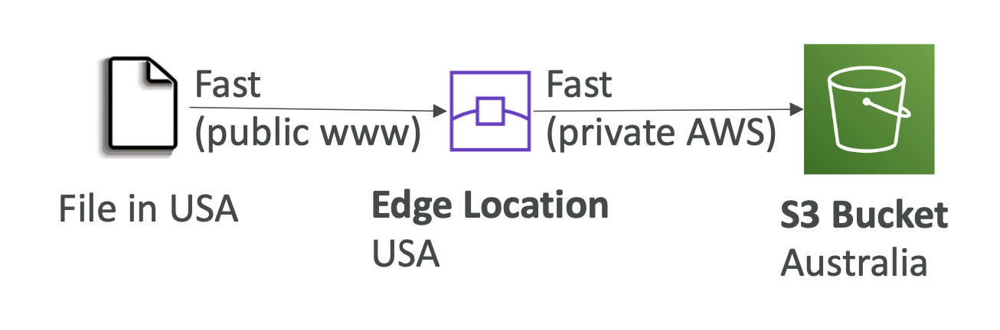
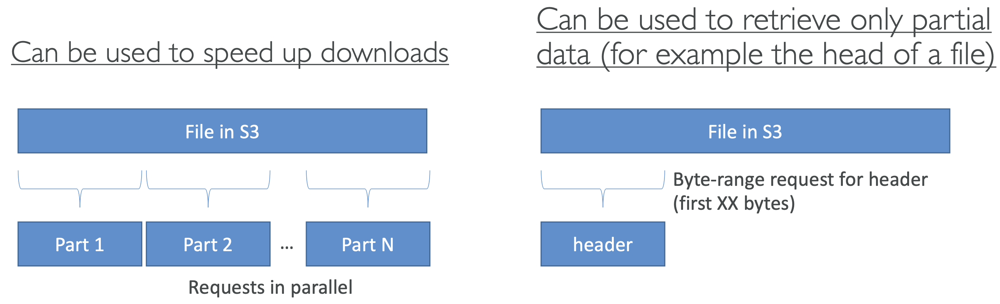
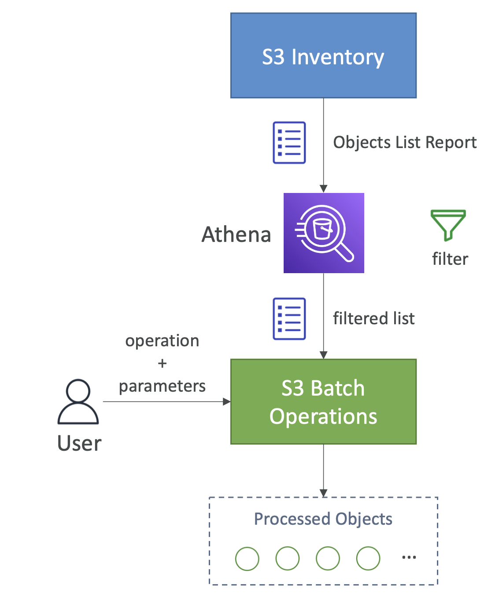
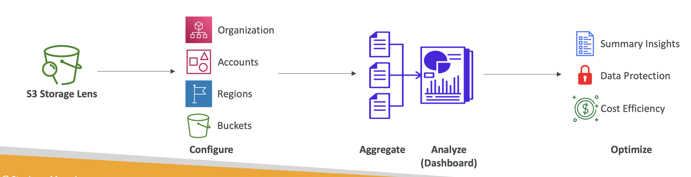

# Amazon S3

Important section. S3 is the backbone of many Amazon services.

> S3 is marketed as an "infinitely scaling" storage solution

## Use cases

- Backup and storage
- Disaster discovery
- Archive
- Hybrid cloud storage
- App hosting
- Media hostiong
- Data lakes
- Static websites
- Software delivery

## Buckets

- Files are stored in "buckets", which can be thought of as top level directories
- Bucket name must be globally unique
- Defined at the region level
- It's global but they're regional
- Naming convention:
  - No uppercase
  - 3-63 chars
  - Not an ip
  - Start w/ lowercase || number

## Objects

Files are called "objects" in S3.

They have a `key`, which is the FULL path of the files.

> The key is composed of a prefix + object name

> There is no concept of directories, but the file names make you think otherwise

Object values are the content of the body. Max size is 5TB.

If the object is > 5gb then you have to use a multi part upload.

Objects have key > value pair metadata.

They also have tags and Version IDs.

## S3 Security

### User based

**IAM Policies** that define which users can make API calls to S3.

### Resource based

- **Bucket policies**: bucket wide rules acros S3
- **Object access control list**: finer grain for specific objects
- **Bucket access control list**

> an IAM principal can access an S3 object if IAM policy allows it and there's no deny rule

### Encryption

Data can be encrypted using encryption keys.

### Bucket policies

[https://docs.aws.amazon.com/AmazonS3/latest/userguide/bucket-policies.html](https://docs.aws.amazon.com/AmazonS3/latest/userguide/bucket-policies.html)

This is the type of policy we will typically employ. The policies define who has access to a bucket. To see a list of policy examples go [here](https://docs.aws.amazon.com/AmazonS3/latest/userguide/example-bucket-policies.html?icmpid=docs_amazons3_console).

You can also use a [policy generator](https://awspolicygen.s3.amazonaws.com/policygen.html).

They are JSON policies:


The `resource` directive defines which buckets the policy applies to. The `action` directive are a set of API methods we can allow/deny, for e.g `GetObject`, meaning we allow anyone to retrieve objects in a bucket.

Typical uses for bucket policies:

- Allowing public access to a bucket
- Force objects to be encrypted at upload
- Allow account access within S3

#### Block public access

You can also block access at the bucket level within S3. This is an additional security measure from S3.

### Example policy

Here is a policy we have generated using the policy generator that allows public access to our S3 bucket:

```json
{
  "Id": "Policy1746257646198",
  "Version": "2012-10-17",
  "Statement": [
    {
      "Sid": "Stmt1746257644933",
      "Action": ["s3:GetObject"],
      "Effect": "Allow",
      "Resource": "arn:aws:s3:::vim-demo-s3-v1.1/*",
      "Principal": "*"
    }
  ]
}
```

## S3 static website hosting

S3 can also be used for static website hosting!

The URL can change depending on the region, either with a dot or a dash after the region:


## Versioning

Versioning in S3 allows you to create versions of S3 objects. It is enabled at the bucket level. 

If you enable versioining, each object will contain a version. Uploading an object will assign an key to it and uploading an object with a key will override the defined object.

It is useful to:

- Protected against unintended deletes
- Roll back to previous versions

## Replication

You can replicate buckets two ways:

1. *CRR*: Cross region replication
2. *SRR*: same region replication

To enable this you must:

- Enable versioning in both source and dest buckets
- Give propoer IAM permissions to S3

Some caveats:

- Only new objects are replicated
- Existing objects can be replicate using **batch replication**
- Only delete markers are replicated
- Chaining isn't possible, e.g replicate from bucket 1 > 2 > 3

> A delete marker in Amazon S3 is a placeholder (or marker) for a versioned object that was specified in a simple DELETE request. A simple DELETE request is a request that doesn't specify a version ID. Because the object is in a versioning-enabled bucket, the object is not deleted. But the delete marker makes Amazon S3 behave as if the object is delete


## Storage classes

### Concepts:

- **Durability**: how often you would lose items
- **Availability**: how ready the S3 service is

Refer to the slides for the details on this or [this documentation](https://docs.aws.amazon.com/AmazonS3/latest/userguide/storage-class-intro.html#sc-compare)

# Advanced S3

## Moving between classes

You can transition between Storage Classes in S3. 

We can do this manually, but also automatically using lifecycle rules.

They can consists of two action types

1. "Transition Actions": transition objects to another class (e.g move to Glacier for archiving after 6 months)
2. "Expiration actions": delete stale files after 365 days.

They can target object prefixes and tags.


## Lifecycle analytics

To help create lifecycle rules, S3 provided analytics (a .CVS export) to help you decide when to transition objects.

## Requester pays

A requester pays bucket means that the requester will pay for the requests for the objects.

Typically, the bucket owner will pay for storage costs + network request, but this model means a requester will pay for the network request portion.

For this to work, the requester must be AWS authenticated:


## Event notifications

Event notifiations let you respond to S3 events and do something.

Some example events could be:

- objectCreated
- objectRemoved
- objectRestored etx

You can then take a follow on action:

- Run a Lambda function
- Send to SNS
- Send to SQS

> Events can take a minute of longer

The ability to send data between S3 and Lambda, for example, is controlled by resouce access policies:


### Event bridge

You can consolidate the event sendings through Amazon EventBridge


## S3 - base performance

- S3 automatically scaled to high request rates, with a latency of 100-200ms
- 3.5k write operations and 5.5k GET operations per prefix per bucket (a prefix is the middle portion of a path: /bucket/folder1/sub1/file -> "/folder1/sub1/"
- Spreading operations across 4 prefixes you can get 22,000 GET operations per second

### Optimising performance

- For files over 100mb (required over 5gb) use **multi part upload**, which parallelises uploads:



- **S3 transfer acceleration**: uses edge locations. It uses private networks to accelerate uploads



- **S3 byte-range fetches**: used to speed up downloads by request portions of a file at each time by just using a byte range within the file. Can also just retrieve portions of a file (such as just getting the headers of a file).



## S3 batch operation

This allows you to match update objects in a bucket. Some example operations:

1. Modify metadata
2. Copy objects between buckets
3. Encrypt / unencrypt
4. Restore
5. Modify ACLs

> Batch is useful because it include retries, progress tracking, notificiation completion etc

You can use **S3 inventory** and **Athena** to retrieve and filter the objects you want to perform batch operations on. 



## S3 Storage Lens

This tool allows you to analyse and optimise S3 across your org. 

It helps uncover anomalies, cost inefficiencies etc

Information can be accessed in a dashboard or exported.



### Storage lens metrics

#### Summary

- StorageBytes, ObjectCount
- *use case*: identify unused prefixes, find fast growing buckets and prefixes

#### Cost

- NonCurrentVersionStorageBytes, IncompleteMultipartUploadStorageBytes
- *use case*: identify buckets with incomplete multipart uploaded older than 7 days, Identify which objects could be transitioned to lower-cost storage class

#### Data protection

- Find buckets not following data protection best practices

#### Access-management 

- *use case*: identify object ownership

Also: event metrics, perf metrics, activity metrics and status codes

### Pricing 

There are 2 tiers: free vs paid

**Free**: 28 metric available for past 14 days
**Advanced**: advanced metrics: activity, advanced cost optimisation etc. Available for 15 months.

