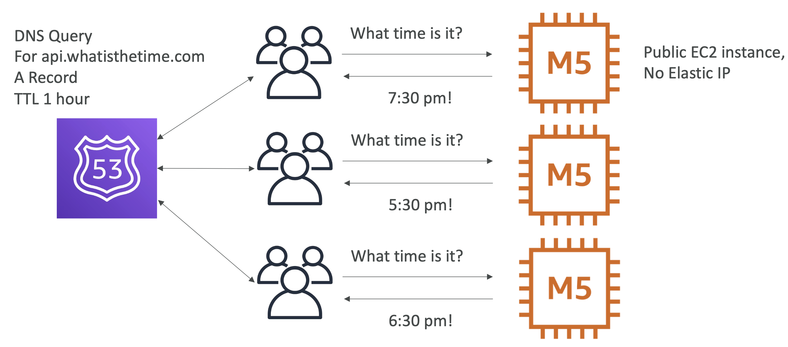
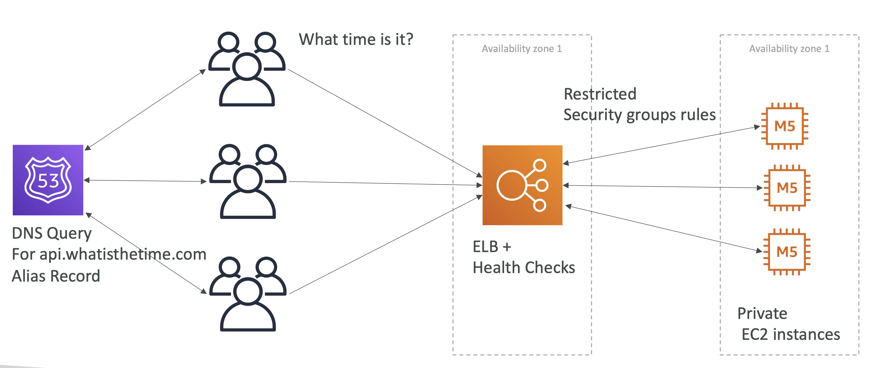
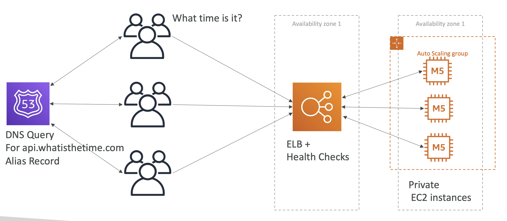

# Solutions architecture

This section is meant to help us get into the mindset of a Solutions Architect working with real world problems. 

We'll use a series of case studies to get into the SA "mindset".

## Use case 1: Whatisthetime.com

### Phase 1 

Let's go from a simple static website to a full auto scaling one that can handle high levels of traffic

Our website simply tells the user what time it is using a T2 instance:

We want the instance to have a static IP, so we attach an [Elastic IP address to it](https://docs.aws.amazon.com/AWSEC2/latest/UserGuide/elastic-ip-addresses-eip.html)

### Phase 2 

Our app is getting more and more traffic and our T2 instance can't keep up. So we upgrade to an M5 instance, with the same public IP (vertical scaling).

Because we had to upgrade, there was downtime, which isn't great! Our users aren't all that happy.

### Phase 3

We are getting more and more traffic to our application and our single M5 instance can't handle it anymore. Instead of scaling vertically, this time we scale horizontally by adding more machines for our app:

Each machine has a static (elastic IP), so we need to manage routing users to the specific instances we want them to go to. 

> User having to be aware of the IP is an issue here, it adds workload and is an inefficient way to route users, because it's manual

### Phase 4

To overcome this static IP issue and having to route users ourselves, we will use Route 53 to handle this for us. This means that if our instance IP changes, we can just update our Route 53 A records and there will be no down time:

We remove one of our instance, which had an A record pointed to it with a TTL of 1 hour:

This meant that the users didn't see anything for one hour because the A record was still around for an hour.

### Phase 5

Let's completely change our architecture. We don't want any downtime and we don't want to have to manage static IPs for each instance. 

So we will use an ELB with health checks. This ELB will be public facing, and our M5 instances will be private. The ELB will point to our private instances. When a suer request is made to our API, it will route requests to our ALB, which will have a health check associated with it. If an instance is down we will route a request to a different instance.

However, because ELB IPs are dynamic and change overtime, we can't use an A record. Instead we use an alias record, which simply points to the ELB resource:

This allows us to add and remove machines over time without having to worry about downtime!

### Phase 6

Adding and remove instances manually is pretty annoying to do.

So let's use an autoscaling group:

### Phase 7

All our instances are in one region, though. 

If there is a disaster in a region the whole app will go down!

So let's make it multiAZ:

## MyClothes.com

Stateful application, ecommerce use case with a "state" of shopping cart. Customers have details in a DB.

### The problem

With our previous architecture, there is no state and consistency for the user. Our load balance will direct users to different instances each time.

Meaning if a user adds something to carts and navigates away, they lose their shopping cart state.

## Phase 1

To solve this, we can introduce ELB stickiness, which is an ELB feature that ensures the same users accesses the same instance with each request:

However, this introduces another problem, that if one of our instances goes down, the user will lose their stickiness and their cart will again be empited on refresh.

## Phase 2

To solve this, we can use cookies. The user will have cookies that store the state of their session, such as what producte are in the shopping cart. 

Regardless of which instance the user gets, their state will be passed back and forth between client and server.

This allows us to achieve a stateless architecture, but there are some drawbacks:

- Security risk from cookies being altered
- Cookies must be less than 4kb 
- Cookies *must* be validated
- HTTP requests are heavier

## Phase 3

To overcome some of these drawbacks, instead of using cookies to store all user data, we just use a `session_id` and use ElastiCache or DynamoDB to store the session iinformation (such as cart info).

Regardless of what instance the user gets, the `session_id` will retrieve the right info from the DB.

## Phase 4

What about long term user data and not session data?

We can use [RDS](/RDS.md) for long term data such as address etc.

## Phase 5

User are reading a lot of data from our website and it isn't scaling. To handle scaling we use RDS read replicas:

## Phase 6

To survive disasters we can make our RDS multi az as well. To bolster security we can use security groups between the ELB and our auto scaling group of instances:

