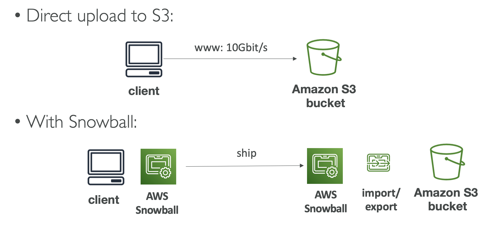
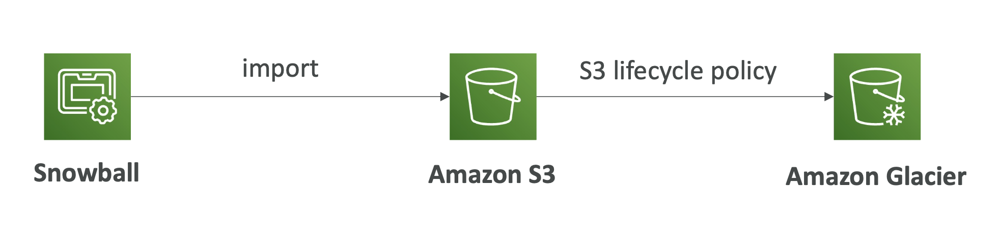
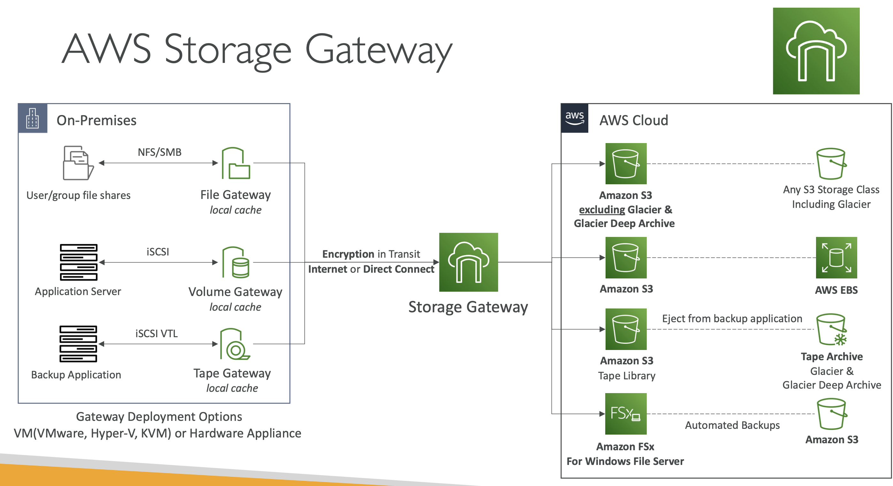

# Extra storage options 

## Snowball

AWS Snowball is a way to migrate data in and out of AWS at the edge using highly secure, portable devices.

### Use case #1: Transferring data

It's a good way to process petabytes of data.

There are two types of Snowball storage devices:

1. **Storage** optimised: 416GB memory / 210TB ssd
2. **Compute** optimised: 416GB memory / 28TB ssd

> If it takes you over a week to transfer data over the network, it's advised to use Snowball instead!

### Use case #2: Edge computing 

Process data while it's being created at an *edge location*.

Edge computing means processing data locally, at the network edge, rather than on a remote computer. It's often used in use cases where there is no network connectivity or compute power:

- A truck on the road
- A ship at sea
- An underground mine

By using a Snowball Edge device, we get a physical machine that can process data locally, at the network edge. It provides:

- Edge compute optimised and storage optimised
- Run EC2 instances and Lambda functions at the edge

> You will receive a physical machine with AWS Snowball

### Snowball to Glacier

Snowball cannot import to Glacier directly. Instead you must use S3 first, in combo with an S£ lifecycle policy:

## FSx

Launch high performance file systems on AWS (like RDS, but for file systems).

### FSx for Windows

- Fully managed windows file system
- SMB / NTFS
- Can also be mounted on Linux EC2
- SSD and HDD options
- Can be multi AZ
- Data backed up to S3

### Amazon FSx for Lustre

- Parallel file system for large scale computing
- Lustre = "Linux" and cluster
- Good for machine learning and high perf computing
- Use cases: video processing, financial modelling, etc
- Scales to 100s GB/s, millions of IOPS, low latency
- SSD and HDD options
- Seamless S3 integration
- Can be on prem

#### File system deployment options

You can deploy the file systems in two ways: **Scratch** or **Persistent**.

**Scratch** is for temporary storage, **Persistent** is for long term.

**Scratch**: data is not replicated, doesn't persist if there is a failure

**Persistent**: data replicated in same AZ

### NetApp ONTAP

- Compatible with NFS, SMB, iSCI protocol
- Broad compatibility
- Autoscales (shrinks or grows)
- Snapshots, replication and data de-dupe

### Amazon FSx for OpenZFS

- Managed ZFS file system on AWS
- Move workloads running on ZFS to AWS
- Up to 1m IOPS with < 0.5ms latency
- Support for point in time

## AWS Storage Gateway

Bridge between on premise data and cloud data.

Depending on the data you want to create a bridge for there are different gateways:

- S3 file gateway
- FSx file gateway
- Volume gateway
- Tape gateway

