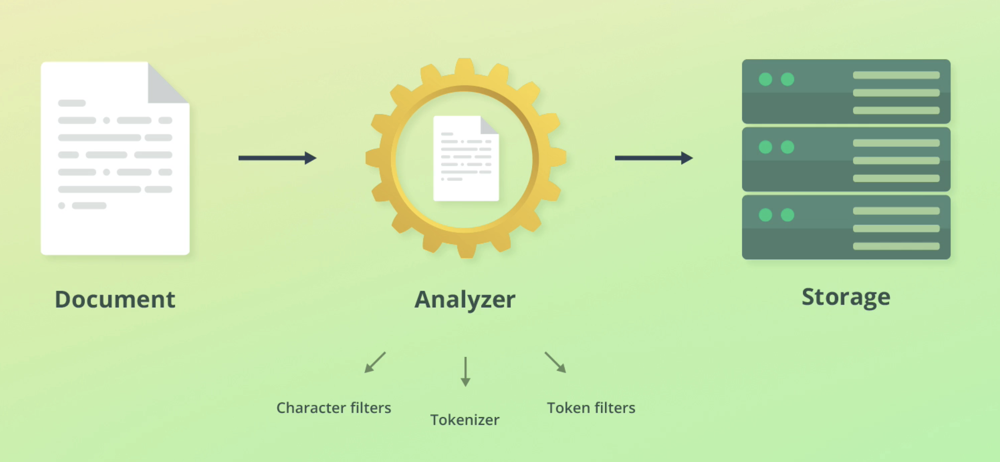

# Analysis / text analysis

**Docs**:
[text analysis](https://www.elastic.co/docs/manage-data/data-store/text-analysis)
[types of token analyzers](https://www.elastic.co/docs/manage-data/data-store/text-analysis/anatomy-of-an-analyzer)

Text analysis is the process of taking raw input data and restructuring it for search optimisation.

In search engines this is usually referred to as tokenization and normalization.

ElasticSearch text analysis is comprised of three main steps: *Character filters, tokenizer, token filters*.
 

## Character filters

Characters filters converts streams of text into unified formats. Examples include:

- Taking Hindu-Arabic numerals and convering into Arabic-Latin equivalents
- Stripping HTML from strings 

## Tokenizer

This splits strings into individual tokens (usually words) by using logical separators.

E.g "Quick brown fox!" -> ["Quick", "brown", "fox"]. It will also strip punctuation at this step.

## Token filters

Adds, changes or removes tokens. For example lowercases *Quick* to *quick*.

> You can use your own analyzers based on the above
