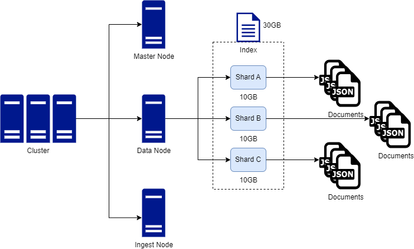

# Elasticsearch architecture

ES used a distributed architecture to maintain performance and availability.

The core concepts behind ES architecture are: clusters, nodes, indices and documents.

## Clusters

A cluster is a collection of nodes. Clusters can house one of multiple nodes.

When you spin up ES, a cluster is automatically created.

Typically, one cluster is enough, but you can have multiple clusters for separation of concerns if needed.

## Nodes

A node is an instance of Elasticsearch. You can operate with one or multiple nodes.

For high volume application, you typically want many nodes.

Nodes are able to communicate with one another and nodes can be of a particular type to perform specific tasks within the cluster (for e.g there can be a data node for storing data and a query node for querying data).

Nodes are what store data in ES.

## Indices

Indices are collections of document. Indice are the logical way in which to organise collections of documents. For e.g in a movie example, there could be an index for actors, an index for directors and an index for movies themselves.

> Indices aren't separated on disk, indices are just references to logical collection of documents.

## Documents

Documents are just JSON object that represent a single entity.
