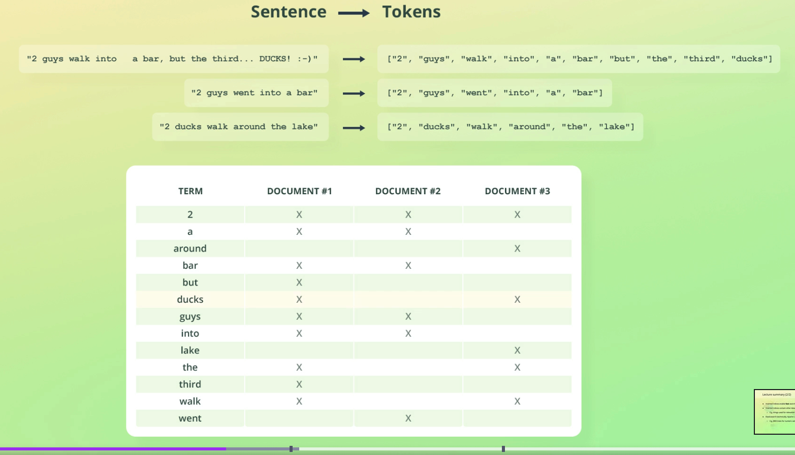
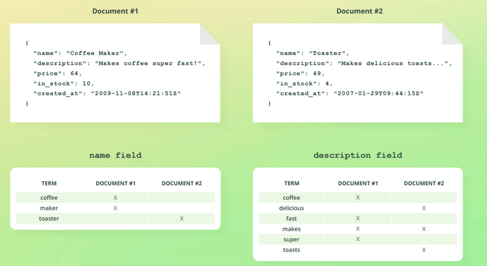

# Inverted Indices

In the [analysers](/analysers) and [analyzer API](/analyze-api) sections we saw how ES tokenizers data.

How ES stores this data is in an inverted index, which is a core search concept.

> Remember that ES is built ontop of Lucene. Apache Lucene is actually the underlying tech that creates the inverted index

## What is an inverted index?

An inverted index is a mapping between terms and the documents that contain them. The "terms" are really the tokens generated in ES' [text analysis](/analysis).

ES takes the following string: `2 guys walk into  a bar, but the third... DUCKS!:-)`.

Performs text analysis on it (and thus tokenization) to output: `["2", "guys", "walk", "into", "a", "bar", "but", "the", "third", "ducks"]`.

This is then stored in an inverted index:



> Inverted indexes allow fast search 

## Different inverted indices

When ES does text analysis it detects the data types of each token.

For example: `4 legged table!` is processed as:

```
{
  "tokens": [
    {
      "token": "4",
      "start_offset": 0,
      "end_offset": 1,
      "type": "<NUM>",
      "position": 0
    },
    {
      "token": "legged",
      "start_offset": 2,
      "end_offset": 8,
      "type": "<ALPHANUM>",
      "position": 1
    },
    {
      "token": "table",
      "start_offset": 9,
      "end_offset": 14,
      "type": "<ALPHANUM>",
      "position": 2
    }
  ]
```

`2` is detected as the `NUM` type, whereas `table` and `legged` are alphanumeric (ALPHANUM).

ES only creates inverted indices for text/alphanumeric/ALPHANUM fields.

Other data types are instead stored in a BKD tree.


