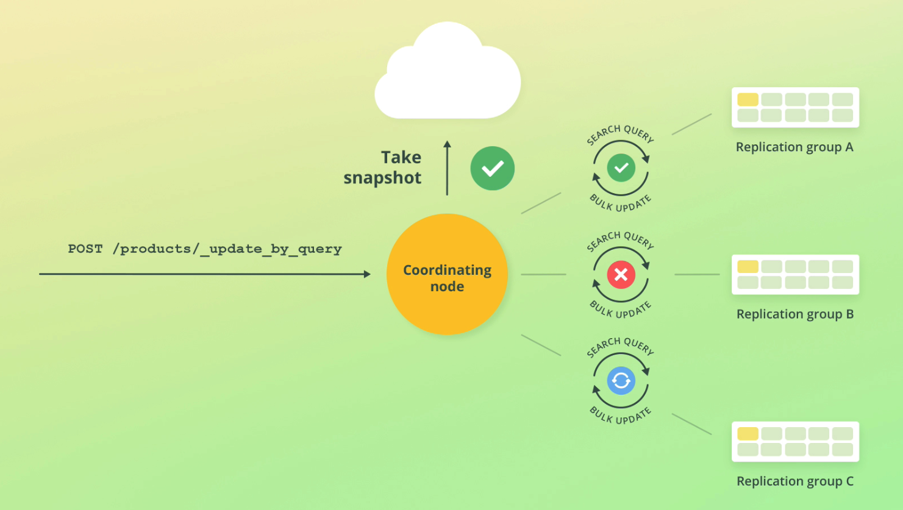

# Managing data

## Deleting indices

Delete an index called pages:

```
DELETE /pages
```

## Adding indices

To add an index called products:

```
PUT /products
```

we can pass in a JSON object as well, defining # of shards and replicas:

```
PUT /products
{
    "settings": {
        "number_of_shards": 2,
        "number_of_replicas": 2
    }
}
```

## Indexing documents

```
POST /products/_doc
{
    "name": "Coffee Maker",
    "price": 64,
    "in_stock": 10
}
```

## Retrieving docs by id

Here with the ID of `100`.

```
GET /products/_doc/100
```

## Retrieving all docs in an index

Here we need to use the `search` endpoint:

```
GET /products/_search 
{
    "query": {
        "match_all": {}
    }
}
```

## Updating docs

```
POST /products/_update/100
{
"doc": {
    "in_stock": 3
}    
}
```

### Adding new fields to docs

Here we use the `update` API. Something to note about this API is that it *replaces* the document, it doesn't update it in situ.

```
POST /products/_update/100
{
"doc": {
    "tags": ["electronics"]
}    
}
```
> Documents are immutable in ElasticSearch, meaning they are deleted and reindexed

## Scripted updates

Reduce stock count by 1. `ctx` is a special variable that allows us to access the source of the object. `ctx._source` allows us to access the source of the object we want to update.

```
POST /products/_update/ig5mHpgBorYWjN5fK4m0
{
   "script": {
        "source": "ctx._source.in_stock--"
   }
}
```
Update the stock value

```
POST /products/_update/ig5mHpgBorYWjN5fK4m0
{
   "script": {
        "source": "ctx._source.in_stock = 11"
   }
}
```

### Using params in scripted updates

We can also pass params that can be used in our updates.

For e.g: if customer purchases 4 products this means we can access this value in our script and use it programatically to reduce stock by 4:

```
POST /products/_update/ig5mHpgBorYWjN5fK4m0
{
    "script": {
        "source": "ctx._source.in_stock -= params.quantity",
        "params": {
            "quantity": 4
        }
    }
}
```

You can add conditional scripts to the `source` using multiline, for e.g skip an update if the stock count is already 0:

```
if(ctx._source.in_stock === 0) {
    ctx.op == 'noop'
}
```

[noop](https://www.elastic.co/docs/api/doc/elasticsearch/operation/operation-update#operation-update-body-application-json) means 'no operation' and will skip the update.
 
## Upsert documents

Upserting documents means to update and insert a document based on whether it exists. If it already exists, a script is run, if not, the doc is indexed.

It still uses the `_update` API:

```
POST /products/_update/101
{
    "script": {
        "source": "ctx._source.in_stock++"
    },
    "upsert": {
        "name": "Blender",
        "price": 399,
        "in_stock": 5
    }
}
```

This example updates the stock of document 101 if it already exists, otherwise it creates a new document with the upsert body.

## Replacing documents

```
PUT /products/_doc/101
{
    "name": "Toaster",
    "price": 500
}
```

## Deleting documents

```
DELETE products/_doc/101
```

## Updating multiple docs by a query

Similar to updates with a `WHERE` clause. i.e find docs based on a condition and then update them.

We use the `update_by_query` endpoint with an attached `query` clause:

```
POST /products/_update_by_query
{
    "script": {
        "source": "ctx._source.in_stock--"
    },
    "query": {
        "match_all": {}
    }
}
```



When ES runs bulk updates it takes an index snapshot is created in order to handle failure cases. ES have a retry mechanism built in as well. If an error occurs, the request returns, but the updates that have occurred remain.

As bulk updates can take some time, there may be changes that have occurred while you run the bulk update. This means the query will fail due to conflicts.

You can override this with `"conflicts": "proceed"`.

More on this topic [here]()

## Deleting multiple docs by a query

```
POST /products/_delete_by_query
{
    "query": {
        "match_all": {}
    }
}
```

## Bulk CURL request

```console
curl --cacert ~/elasticstack/elasticearch/config/certs/http_ca.crt -u elastic  -H "Content-Type: application/x-ndjson" -XPOST https://localhost:9200/products/_bulk --data-binary "@products-bulk.json"
```

### Index vs create actions:

- Create actions fail if docs already exist
- Index action will add doc if already exists, otherwise it replaced
