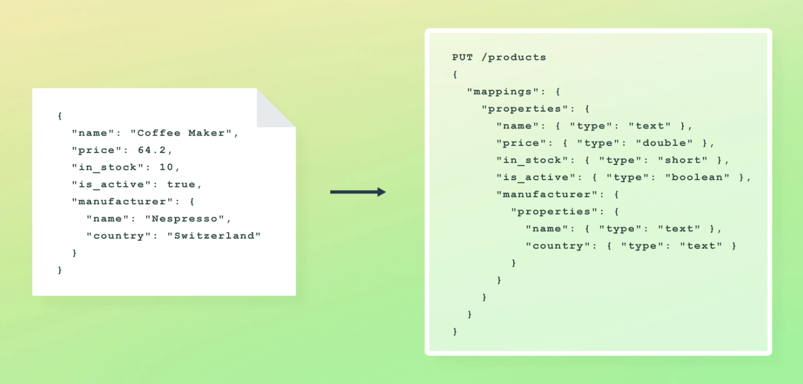
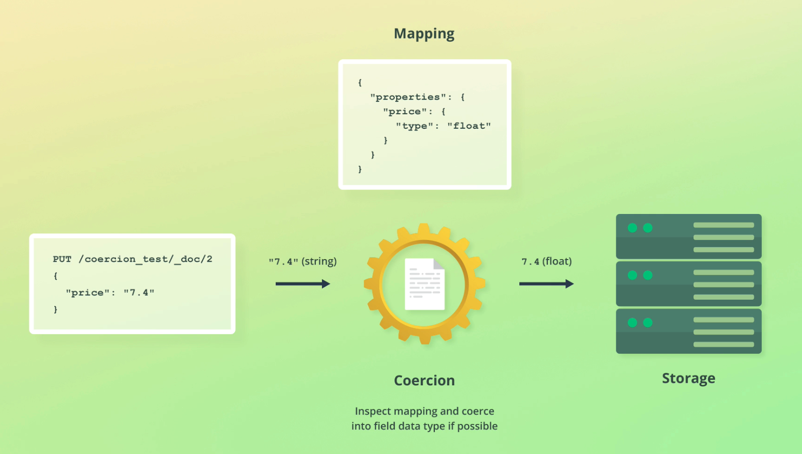

# Mapping

[relevant docs](https://www.elastic.co/docs/manage-data/data-store/mapping)

Mapping defines the structure of documents, ie their fields and their data types.

[here](/useful-commands)

We can either:

1. Define custom mappings, OR
2. Let ES generate mappings for us

## Data types

Available data types are [here](https://www.elastic.co/docs/reference/elasticsearch/mapping-reference/field-data-types).

We have typical data types like text, float, integer, boolean etc. But there are specific data types in ES that power specific use cases that are of interest:

**Object**

Objects may be nested to form a hierarchy. Instead of defining the `type`, ES instead defines a `properties` for the object:



**Arrays of objects**

ES flattens arrays of objects, which can cause some issues.

E.g 

```json
{
  "group" : "fans",
  "user" : [
    {
      "first" : "John",
      "last" :  "Smith"
    },
    {
      "first" : "Alice",
      "last" :  "White"
    }
  ]
}
```
Is flattened to 

```json
{
  "group" :        "fans",
  "user.first" : [ "alice", "john" ],
  "user.last" :  [ "smith", "white" ]
}
```
And we lose relationships between fields.

To solve this we can define the object type as `Nested`. Read more [here](https://www.elastic.co/docs/reference/elasticsearch/mapping-reference/nested).

> Nested objects are hidden in the background

**Keyword**

[reference](https://www.elastic.co/docs/reference/elasticsearch/mapping-reference/keyword)

`keyword` is used for exact value matching. This is used for filtering, sorting and aggregating docs.

We can't use keyword fields for full text search. For keyword fields, a different analyzer is used, called the ["keyword" analyzer](https://www.elastic.co/docs/reference/text-analysis/analysis-keyword-analyzer). This is a `noop` analyzer, meaning it just re-outputs the string as a single token. This is because it's intended for *exact* matching.

You can still configure the analyzer, however, for example to lowercase keyword fields.

If you want a field to be of both type `keyword` and `text`, you can achieve this using the fields [mapping parameter](https://www.elastic.co/docs/reference/elasticsearch/mapping-reference/multi-fields).
    
## Type coercion

With dynamic mapping, ES will do type coercion. For example the string "7.4" will be converted to a float.




