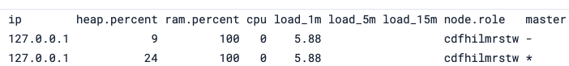

# Node roles

[Relevant docs](https://www.elastic.co/docs/deploy-manage/distributed-architecture/clusters-nodes-shards/node-roles)

As we know, an ES cluster consists of one or multiple nodes. Nodes *typically* contain shards, but this isn't always the case.

This is because nodes can be assigned different roles that do different things. The roles are:

- **Master-eligible**: A node may be elected as the [master node](https://www.elastic.co/docs/deploy-manage/distributed-architecture/clusters-nodes-shards/node-roles#master-node-role). A master node do cluster wide actions such as shard allocation, creating and deleting indices etc. This role doesn't mean the cluster *will* be the master, just that it is eligible. There is a voting process for this.
- **Data**: The [data role](https://www.elastic.co/docs/deploy-manage/distributed-architecture/clusters-nodes-shards/node-roles#data-node-role) means the node stores data and performs queries related to the data on that node.
- **Ingest**: The [ingest role](https://www.elastic.co/docs/deploy-manage/distributed-architecture/clusters-nodes-shards/node-roles#node-ingest-node) enables a node to run ingest pipelines (like adding documents to indices). You can think of this as a simplified Logstack pipeline, but for full functionality, Logstash is better. Ingest roles are best for relatively simple operations.
- **Machine learning**: The [ML role](https://www.elastic.co/docs/deploy-manage/distributed-architecture/clusters-nodes-shards/node-roles#ml-node-role) role allows the node to run jobs and machine learning API requests that don't affect other tasks.
- **Coordination**: The [coordination role](https://www.elastic.co/docs/deploy-manage/distributed-architecture/clusters-nodes-shards/node-roles#coordinating-only-node-role) coordinates queries across the cluster. It doesn't run queries, just delegates the task to other nodes. Note that every node is a coordination node, however for a node to be a dedicated cooordination node, it has to have an empty role list []. There is a section on that [here](https://www.elastic.co/docs/deploy-manage/distributed-architecture/clusters-nodes-shards/node-roles#node-roles-list), this is typically best for large clusters that need some load balancing.
- **Voting only**: Not that important, but read more [here](https://www.elastic.co/docs/deploy-manage/distributed-architecture/clusters-nodes-shards/node-roles#voting-only-node)

To see node roles:

```
GET /_cat/nodes?v
```


## When to change node roles

- When optimising the cluster to scale requests
- Often something done for large clusters

> Typically, changing nodes, shards and replicas is something you'd do before resorting to changing node roles

> Never change roles unless you are sure what you're doing!
