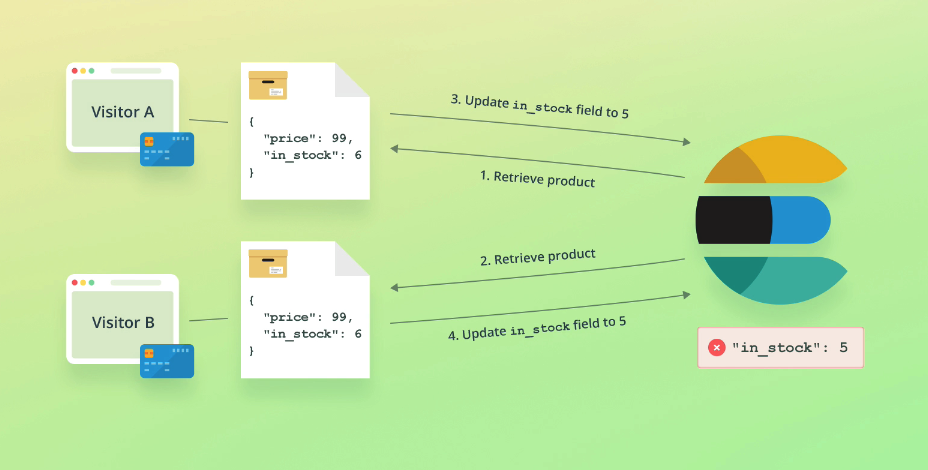
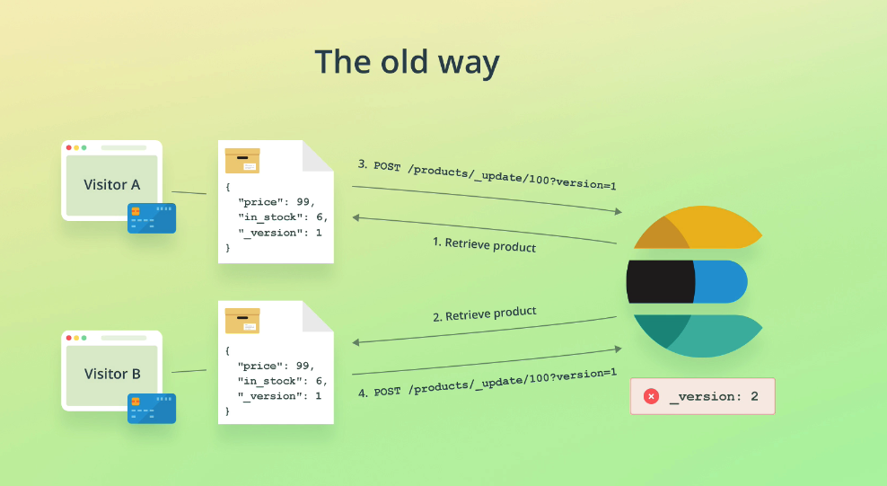
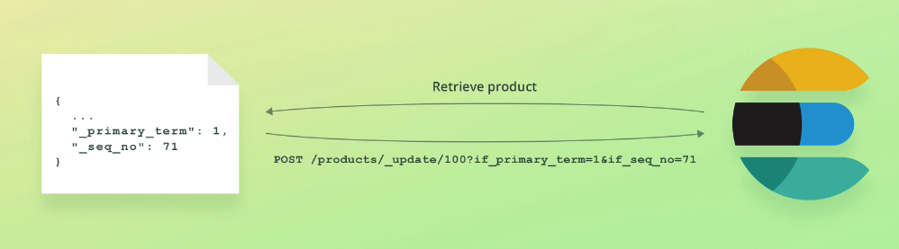

# Optimistic concurrency control

This prevents overwriting documents inadvertently due to concurrent operations.

*Example scenario:*

Imagine a scenario where two customers retrieve product data at the same time, the first customer purchases the product and the stock count is updated in ES. The second customer does the same, but updates the stock count thinking the "live" value is the same as it was when it was retrieved, when in fact it's 1 less due to the first customers purchase:



We need our second update to fail if the document has been modified since we retrieved it.

### The old way

Of solving this problem involved sending down version numbers of documents:



### The new way

Uses primary terms and sequence numbers:



```
{
  "_index": "products",
  "_id": "ig5mHpgBorYWjN5fK4m0",
  "_version": 6,
  "_seq_no": 5, // here
  "_primary_term": 4, // here
  "found": true,
  "_source": {
    "name": "Coffee Maker",
    "price": 64,
    "in_stock": 8,
    "tags": [
      "electronics"
    ]
  }
}
```

Primary terms and sequence numbers are returned in the results, which we can use for update request:

```
POST /products/_update/ig5mHpgBorYWjN5fK4m0?if_primary_term=4&if_seq_no=5
{
    "doc": {
        "in_stock": 7
    }
}
```
The doc will only be update if the `primary_term` and `seq_no` no match the document in ES. This means updates can't happen if a doc has been updated in the time since we retrieved the product.

## How to handle failures

After this failure you need to handle your own retries:

1. Retrieve doc again
2. Use `primary_term` and `seq_no` for new updates


