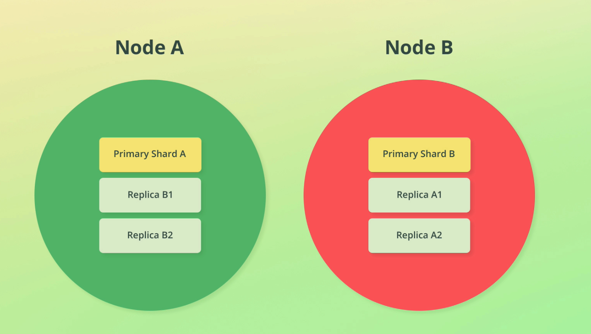
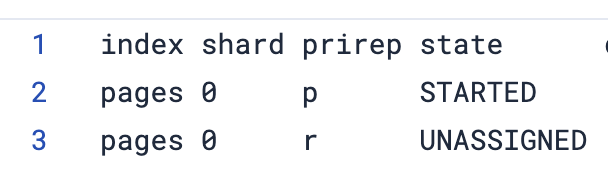
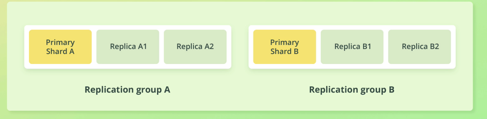
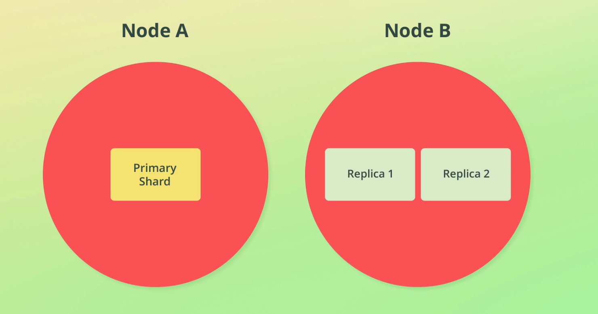

# Replication

Replication in ES is the process of duplicating data for the purpose of fault tolerance to avoid losing data.

Replication is done at the index level and involves creating a copy of shards, called *replica shards*. A replicated shard is a *primary shard*.



If we replicate shards across nodes, we can introduce fault tolerance *if* the nodes are on different machines. See this [discussion](https://discuss.elastic.co/t/single-server-single-node-vs-single-server-multiple-node/324081/4) on single server vs multi server implem.

> Replicate shards once for non critical systems, replicate twice for critical systems

> A replica is never allocated to the same node as its primary shard. If we only have 1 node and we create a replica, that index will have nowhere to go, so it will get a YELLOW status

To see a list of shards use the following command:

```console
GET /_cat/shards?v&index=*,-.*,-.internal.*,-.*default*
```

(**note** the query params are for only showing non-internal indices)

Output:



We can see the replica shard is unallocated because we only have 1 node.

## Replication group

A replication group is simply a primary shard's replicas and the primary shard as well.



## Throughput

Replication can also help with *throughput*. A replica shard can be queried just like a primary shard (in fact, ES will route requests to the *best* shard to query).

Below you can see we have three shards across two nodes - this means if 3 requests come through at once, we can spread the load across the shards and achieve parallelization.



## Snapshots

Snapshots allow backups to a point in time. They can snapshot:

- Specific indices
- Clusters

> Replication is best for fault tolerance for the *current state*, whereas snapshots are best for historical backups and getting things back to a working state.


