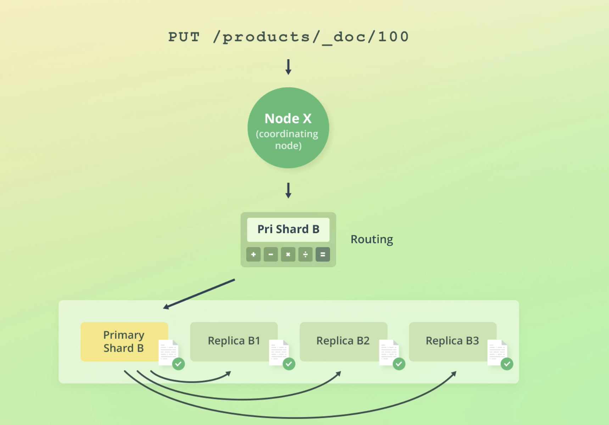

# Routing

As we shard our indices in ES, the question arises how does ES know where to store documents? In which shard?

Also: how does ES know from which shard to retrieve our documents when a query is performed?

The answer is **routing**.

> Routing is the process of resolving a shard for a document, for both indexing and retrieval

## Routing formula

ES uses a simple formula to determine which shard to reach out to:

A benefit of this formula is that ES handles this all for us and documents are distributed evenly amongst our shards without our input:

## How ES reads data

## How ES writes data

First, ES routes the request to a replication group. But after that, it routes the request to the primary shard, which is responsible for:

- Validating the request
- Writing the data locally
- Forwarding to replica shards in paralell

> Writing data is always routed to the primary shard, validates the data, stores locally then onsends to replicas

### How ES handles write failures

[More notes on this here](/optimistic-concurrency-control.md)

If failures occur, let's say for example, when the primary shard goes down, ES initiates a recovery process. We won't go into too much detail about the recovery proces, but there is one main topic to understand:

#### Primary terms and sequence numbers

**Primary terms** is a way to to distinguish between old and primary shards. For e.g is a primary shard fails, a replica is promoted to primary and the primary term counter is increased by 1.

**Sequence numbers** is a counter that is incremented for each operation until the primary shard changes. This lets ES know which order operations occurred on a primary shard.

> Both primary terms and sequence numbers are used to help ES recover from a primary shard failure

#### Global and local checkpoints

These are sequence numbers. 

- A replication group has *global* checkpoints
- A replication shard has *local* checkpoints

This helps ES recover data with specific checkpoints. ES only needs to compare the delta between current state and checkpoints in shards and groups to get a shard back up to the right state.

## Document versioning

*_version* metadata field is an integer that is incremented when modifying a document.

> This is referred to as internal versioning

