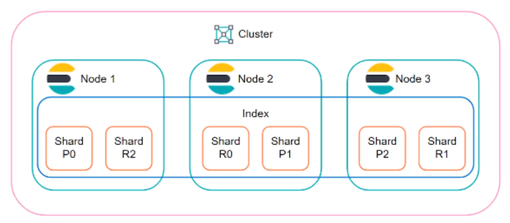

# Sharding and scalability

Sharding is the practice of splitting indices into smaller chunks. This allows you to scale data volume [horizontally](https://en.wikipedia.org/wiki/Scalability#Horizontal_(scale_out)_and_vertical_scaling_(scale_up)).

ES Shards are at the index level and each index is comprised of one or more shards. An index can have many shards, but a shard can only belong to one index.

ES is built on top of Apache [ Lucene ](https://en.wikipedia.org/wiki/Apache_Lucene) and technically, each shard is an instance of Lucene, which is comprised of an [inverted index](https://en.wikipedia.org/wiki/Inverted_index).

## ES Sharding example

Say we have two ES nodes each with a 500GB capacity. We also have a index that is 600GB. This index won't be able to fit onto either node, so we can splut the index into multiple shards and place each shard onto a node.

## Purposes

- To store more documents
- Fit large indices onto nodes
- Improve performance through query parallelization (search happens at the shard level, so searches can be run across multiple shards at once)

## Tech details

- Prior to `V7.0.0` ES created indices with 5 shards automatically
- Now an index only contains 1 by default to prevent over sharding
- You can increase # of shards with [Split API](https://www.elastic.co/docs/api/doc/elasticsearch/operation/operation-indices-split)
- You can decrease # of shards with [Shrink API](https://www.elastic.co/docs/api/doc/elasticsearch/operation/operation-indices-shrink)

> The optimal number of shards really depends on the use case, but you should plan sharding in alignment with data size across the cluster
