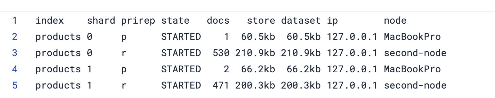

# Useful Elastic command

## Remove Mac gatekeeper signature from .tar download

```console
xattr -r -d com.apple.quarantine <elastic-path>
```

## Extract kibana and ES .tar archives

```console
tar -xvf <path>
```

## Reset `elastic` user password

```console
bin/elasticsearch-reset-password -u elastic
```

## Generate new Kibana token

```console
bin/elasticsearch-create-enrollment-token --scope kibana
```

## Generate new Node token

This is useful for when spinning up new nodes in our cluster.

```console
 bin/elasticsearch-create-enrollment-token --scope node
```

## Know why shards are unassigned

```
GET /_cluster/allocation/explain
```

## Check shard health

```
GET /_cat/shards?v&index=*,-.*,-.internal.*,-.*default*
```

You will see doc distribution across shards in the response:


